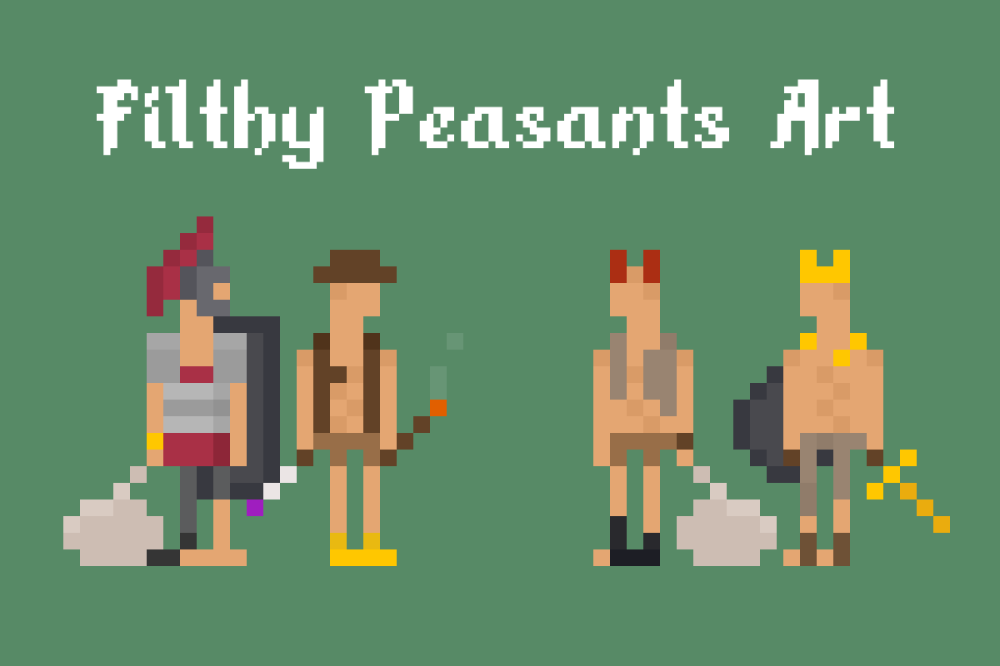

  
   

# Filthy Peasants Art

The art side of Filthy Peasants NFT collection.

- [Twitter](https://twitter.com/FilthyNFTs)
- [OpenSea](https://opensea.io/collection/filthypeasants)
- [Discord](https://t.co/91Q4fwRpVT)
- [Etherscan](https://etherscan.io/address/0xde892c47562a4a383f2f88447cd3082d5a9688e4)

The very core of the project is from a [create-and-mint-nft-collection](https://github.com/thepeanutgalleryandco/create-and-mint-nft-collection) repository. If you need guidance on how to build the project, generate your own collection and make changes to the code. Look at the [linked](https://github.com/thepeanutgalleryandco/create-and-mint-nft-collection) repo and explore the documentation there.

## What is included?

- All the assets used during the generation of the collection.
- The generated collection of 333 Filthy Peasants.
- Small adjustments to the code which enabled me to make some traits hidden from metadata json.

## What can I do with it?

It has a MIT licence. You can do whatever you want with the repo.
